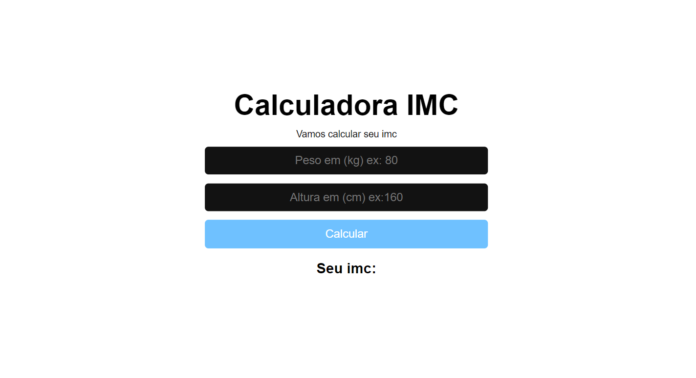
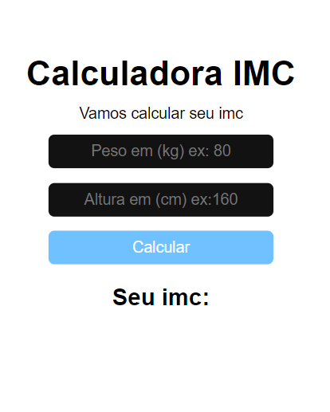

<h1 align="center"> Calculadora Imc </h1>

  

 

 <a href="#-sobre-o-projeto">Sobre</a> •
 <a href="#-funcionalidades">Funcionalidades</a> •
  <a href="#-tecnologias">Tecnologias</a> •
 <a href="#-layout">Layout</a> • 
 <a href="#-autor">Autor</a> 

## 💻 Sobre o projeto

Uma calculadora de IMC (Índice de Massa Corporal) em React.

---

## ⚙️ Funcionalidades

- [x] Entrada de Dados:
  - [x] O usuário pode inserir sua altura e peso em campos de entrada. Esses valores são capturados e armazenados em variáveis de estado do React.
- [x] Cálculo do IMC:
  - [x] Com base nos valores de altura e peso fornecidos pelo usuário, o IMC é calculado usando a fórmula adequada. 

---

## 🚀 Tecnologias

Esse projeto foi desenvolvido com as seguintes tecnologias:

- HTML e CSS
- React
- Git e Github

---

## 🎨 Layout

### Mobile

  

### Desktop

  

---

## 🦸 Autor

 
  
 <b>Amanda Lucia</b>
 
  

  

---

Feito com ❤️ por Amanda Lucia 👋🏽 [Entre em contato!](https://www.linkedin.com/in/amanda-lucia-ribeiro-pereira-434892229/)